# 🤝 Bandhan AI - Voice-First AI Companion for Indian Families

### *बंधन - Connecting Hearts Across Distances* 💝

---

## 🌟 About Bandhan AI

Bandhan AI is a voice-first, generative AI companion designed to bridge the emotional and physical gap between aging parents in Tier-2/3 Indian cities and their migrant children. The system addresses loneliness, loss of purpose, and digital anxiety through AWS Generative AI acting as an "Emotional Mediator."

| 🗣️ **Voice-First** | 🤖 **AI-Powered** | 👨‍👩‍👧‍👦 **Family-Centric** | 🏛️ **Made for India** |
|:---:|:---:|:---:|:---:|
| Zero-UI Design | AWS Bedrock | Relationship Intelligence | Multi-language Support |
| 200ms Response | Claude 3 Haiku | Bond Score Tracking | Cultural Context |

## 🎯 Vision

To create meaningful connections between generations separated by distance, using AI to preserve family bonds, ensure elderly care, and maintain cultural heritage through technology that feels natural and accessible.

## 🏛️ Alignment with India's AI Mission

### *Supporting the IndiaAI Mission - Building Tomorrow's India*

Bandhan AI directly contributes to **6 out of 7 pillars** of India's national AI strategy:

<table>
<tr>
<td>

### 💻 **IndiaAI Compute**
- Leverages AWS ap-south-1 infrastructure
- Optimized for Indian data sovereignty
- Supports concurrent users efficiently
- GPU-efficient voice processing

</td>
<td>

### 📊 **IndiaAI Datasets**
- Indian family interaction datasets
- Multi-language voice corpus
- Cultural context training data
- Privacy-preserving data sharing

</td>
</tr>
<tr>
<td>

### 🚀 **Application Development**
- Citizen-centric AI applications
- Elderly-accessible interfaces
- Emergency response systems
- Healthcare navigation tools

</td>
<td>

### 🎓 **FutureSkills**
- Open-source contributions
- Developer community building
- AI literacy for families
- Technical documentation

</td>
</tr>
<tr>
<td>

### 💡 **Startup Financing**
- Innovative AI startup model
- Social impact focus
- Scalable business approach
- Job creation in Tier-2/3 cities

</td>
<td>

### 🛡️ **Safe & Trusted AI**
- Ethical AI development
- Privacy-first architecture
- Transparent algorithms
- Cultural sensitivity

</td>
</tr>
</table>

### 🎯 **Key Alignment Areas**

| **IndiaAI Mission Goal** | **Bandhan AI Implementation** |
|:---|:---|
| 🌐 **Democratize AI Access** | Zero-UI voice interface accessible to elderly users |
| 🏠 **Address Local Challenges** | Tackles elderly loneliness and family disconnection |
| 💼 **Generate Employment** | Creates jobs in healthcare, customer support, and AI training |
| 🌟 **Global AI Leadership** | Showcases India's capability in culturally-aware AI |
| 📱 **Inclusive Technology** | Supports multiple Indian languages and dialects |
| 🔒 **Data Sovereignty** | All processing within Indian borders (ap-south-1) |

## ✨ Key Features

### *"माँ-बाप से बात करना अब हुआ आसान"* 
*Making conversations with parents effortless*

### 🗣️ Hyper-Local Voice Interface
- **Zero-UI Design**: Single pulsing circle interface for maximum simplicity
- **Multi-Language Support**: Hinglish, Tanglish, Bengali with code-mixing
- **200ms Response Time**: Near-instantaneous voice activity detection
- **95% Accuracy**: Advanced transcription with cultural context understanding

### 💝 Relationship Intelligence
- **Bond Score Tracking**: Quantitative relationship health monitoring
- **Mood Analysis**: Voice-based emotional state detection
- **Weekly Reports**: Automated insights for family members
- **Intervention Alerts**: Proactive suggestions when relationships need attention

### 🚨 Emergency Response System (SafeMode)
- **5-Second Activation**: Instant emergency protocol initiation
- **Smart Triage**: AI-powered severity assessment and de-escalation
- **Hyper-Local Network**: Neighbors → Family → Emergency Services escalation
- **30-Second Cancellation**: Easy false alarm cancellation

### 📸 Shared Memory Archive
- **Voice Narrations**: AI-generated descriptions for family photos
- **Semantic Search**: Find memories using natural language
- **3-Second Retrieval**: Lightning-fast memory access
- **Automatic Categorization**: Smart organization by relationships and events

### 🏥 Care Navigation
- **Medicine Recognition**: Photo-based medication identification
- **Government Schemes**: Simplified explanations of benefits and eligibility
- **Health Guidance**: Reliable medical information with appropriate disclaimers
- **Form Assistance**: Step-by-step bureaucratic process guidance

### 📹 AI-Enhanced Video Communication
- **Context-Aware Prompts**: Conversation starters based on recent activities
- **Pre-Call Briefings**: Mood and activity updates for meaningful conversations
- **Topic Suggestions**: AI-powered conversation flow assistance
- **Call Summaries**: Key discussion points for both parties

### 💬 Emotion-Aware Messaging
- **Tone Analysis**: Emotional appropriateness checking
- **Cultural Context**: Indian family communication guidance
- **Message Coaching**: Gentle language suggestions
- **Simplified Reading**: Complex message translation for elderly users

## 🏗️ Architecture

### *Cloud-Native AWS Infrastructure*
**Built for Scale, Security, and Sovereignty**

```mermaid
graph TB
    subgraph "📱 Client Layer"
        A[📱 React Native Mobile App]
        B[💻 Next.js Web Dashboard]
        C[🎤 Voice Interface Device]
    end
    
    subgraph "🌐 API Gateway Layer"
        D[🚪 AWS API Gateway]
        E[⚡ WebSocket API Gateway]
    end
    
    subgraph "🔐 Authentication & Security"
        F[👤 AWS Cognito]
        G[🔑 AWS KMS]
    end
    
    subgraph "⚙️ Core Processing Layer"
        H[🗣️ Voice Processing Lambda]
        I[💝 Relationship Engine Lambda]
        J[🚨 Emergency Response Lambda]
        K[📸 Memory Archive Lambda]
        L[🏥 Care Navigator Lambda]
    end
    
    subgraph "🤖 AI Services"
        M[🎙️ Amazon Transcribe]
        N[🧠 Amazon Bedrock - Claude 3 Haiku]
        O[🔊 Amazon Polly]
        P[👁️ Amazon Rekognition]
        Q[🔍 Amazon Titan Embeddings]
    end
    
    subgraph "💾 Data Layer"
        R[👥 DynamoDB - User Profiles]
        S[📚 Aurora PostgreSQL - Memory Archive]
        T[📁 S3 - Media Storage]
        U[📊 Amazon Kinesis - Real-time Analytics]
    end
    
    subgraph "🔄 Orchestration & Messaging"
        V[⚡ AWS Step Functions]
        W[📢 Amazon SNS]
        X[📅 Amazon EventBridge]
    end
    
    A --> D
    B --> D
    C --> E
    D --> H
    E --> H
    H --> M
    H --> N
    H --> O
    I --> N
    I --> U
    J --> V
    V --> W
    K --> P
    K --> N
    L --> Q
    L --> S
    H --> R
    I --> R
    J --> R
    K --> R
    L --> T
```

### 🔒 **Data Sovereignty & Security**

| **🌍 Region** | **🔐 Encryption** | **🔑 Key Management** | **📋 Compliance** |
|:---:|:---:|:---:|:---:|
| ap-south-1 (Mumbai) | AES-256 at rest | AWS KMS with | Indian data protection |
| Complete Indian data residency | TLS 1.3 in transit | automated rotation | requirements |

## 📋 Project Specifications

This repository contains the complete specifications and design documents for Bandhan AI. The project is currently in the design and planning phase.

### 📁 Repository Structure
- **`.kiro/specs/bandhan-ai/`** - Complete project specifications
  - `requirements.md` - Detailed requirements and acceptance criteria
  - `design.md` - Technical architecture and design decisions
  - `tasks.md` - Implementation roadmap and task breakdown

### 🎯 Current Status
- ✅ Requirements Analysis Complete
- ✅ System Architecture Designed
- ✅ Technical Specifications Documented
- 🔄 Implementation Planning in Progress

## 📱 Planned Platform Support

### Mobile Application (React Native)
- **iOS**: 13.0+
- **Android**: API Level 21+ (Android 5.0)
- **Features**: Voice interface, emergency response, video calls
- **Offline**: Critical emergency functions available offline

### Web Dashboard (Next.js)
- **Browsers**: Chrome 90+, Firefox 88+, Safari 14+
- **Features**: Family insights, memory archive, care navigation
- **Responsive**: Optimized for desktop and tablet

### Voice Interface Device
- **Hardware**: Raspberry Pi 4+ or dedicated IoT device
- **Connectivity**: Wi-Fi, optional 4G/5G
- **Audio**: High-quality microphone and speaker array
- **Display**: Single LED indicator for status

## 🧪 Planned Testing Strategy

The system uses comprehensive property-based testing to ensure correctness across all scenarios:

### Property-Based Testing
- Voice processing accuracy across language combinations
- Mood analysis consistency across voice samples
- Memory search performance across various query types
- Security compliance across all data operations
- Performance characteristics under various load conditions

### Unit Testing
- Emergency keyword detection with specific phrases
- Cultural context validation for Indian family communication
- Medicine bottle recognition with known medications
- Government scheme database accuracy
- Accessibility compliance verification

### Integration Testing
- End-to-end emergency response workflows
- Cross-service communication validation
- Multi-language conversation flows
- Family interaction simulation testing
- Regional compliance verification

## 🔒 Planned Security & Privacy

### Data Protection
- **Encryption**: All data encrypted at rest and in transit
- **Access Control**: Role-based permissions with family consent
- **Audit Logging**: Comprehensive access and modification tracking
- **Data Retention**: Configurable retention policies with user control

### Privacy Features
- **Local Processing**: Voice processing can run locally for sensitive conversations
- **Selective Sharing**: Granular control over what data is shared with family
- **Right to Deletion**: Complete data removal on user request
- **Transparency**: Clear data usage explanations in local languages

## 🌐 Localization

### *"हर भाषा में, हर दिल तक"*
*In every language, to every heart*

### 🗣️ Supported Languages
- **हिंदी (Hindi)**: Full support with regional dialects
- **English**: Indian English with cultural context
- **বাংলা (Bengali)**: Complete language support
- **Hinglish**: Natural code-mixing patterns
- **Tanglish**: Tamil-English code-mixing
- **Regional**: Expanding to other Indian languages

### 🎭 Cultural Adaptation
- **Family Terms**: Proper addressing conventions (ji, sahib, etc.)
- **Festival Awareness**: Context-aware responses during Indian festivals
- **Regional Customs**: Location-specific cultural understanding
- **Government Schemes**: State-specific benefit information

## ⚡ Target Performance Metrics

### *Lightning-Fast, Always Reliable*

### 🚀 Response Times
- **🗣️ Voice Commands**: <500ms for 95% of requests
- **🚨 Emergency Response**: <5 seconds activation
- **🔍 Memory Search**: <3 seconds retrieval
- **📹 Video Call Setup**: <10 seconds connection

### 🛡️ Reliability
- **⏰ System Uptime**: 99.9% during peak hours
- **🔄 Failover Time**: <30 seconds automatic recovery
- **💾 Data Backup**: Every 6 hours with point-in-time recovery
- **👥 Concurrent Users**: Support for thousands of simultaneous connections

## 🤝 Contributing

### *"सबका साथ, सबका विकास"*
*Together we build, together we grow*

We welcome contributions from developers, linguists, healthcare professionals, and community members!

### 📋 Development Guidelines
- **Code Style**: Follow ESLint and Prettier configurations
- **Testing**: Add property-based tests for new features
- **Documentation**: Update relevant documentation
- **Accessibility**: Ensure WCAG AAA compliance
- **Localization**: Consider multi-language impact

## 📋 Development Roadmap

### Phase 1: Core Platform
- Voice interface with multi-language support
- Basic emergency response system
- Memory archive with photo narration
- Mobile app beta release

### Phase 2: Enhanced Intelligence
- Advanced mood analysis with intervention suggestions
- Predictive health monitoring
- Smart home integration
- Expanded government scheme database

### Phase 3: Community Features
- Neighborhood networks for hyper-local support
- Intergenerational skill sharing platform
- Cultural event coordination
- Community health initiatives

### Phase 4: Scale & Expansion
- Support for additional Indian languages
- Integration with healthcare providers
- Government partnership programs
- International diaspora support

## 📞 Future Support Plans

### For Users
- **Help Center**: Available online documentation
- **Support**: Multi-language customer support
- **Video Tutorials**: Available in multiple Indian languages
- **Community Forum**: User community discussions

### For Developers
- **Documentation**: Comprehensive technical documentation
- **API Reference**: Complete API documentation
- **Community**: Developer community channels
- **Issues**: Bug reports and feature requests

## 🌟 Expected Impact

### *Transforming Lives Across Bharat*

### 🏠 **Social Impact**
- **👨‍👩‍👧‍👦 Families Connected**: Thousands of families using the platform
- **🚨 Emergency Responses**: Hundreds of successful emergency interventions
- **📸 Memories Preserved**: Extensive family memory archives
- **🗣️ Languages Supported**: Multiple Indian languages with ongoing expansion

### 🚀 **Technical Innovation**
- **🎙️ Voice Accuracy**: High transcription accuracy for Indian English
- **⚡ Response Time**: Industry-leading voice processing speed
- **🎭 Cultural Context**: First AI system designed specifically for Indian families
- **♿ Accessibility**: WCAG AAA compliant for elderly users

### 🏛️ **Contributing to Digital India**

Bandhan AI supports key Digital India initiatives:

- **🏛️ Digital Governance**: Simplifying government scheme access for elderly citizens
- **🤝 Digital Inclusion**: Making AI accessible to non-tech-savvy users
- **💪 Digital Empowerment**: Enabling independent living for aging population
- **🌐 Digital Infrastructure**: Leveraging India's robust cloud ecosystem
- **🎓 Digital Literacy**: Teaching families to embrace AI technology
- **🔒 Digital Security**: Maintaining data sovereignty within Indian borders

---

**Made with ❤️ for Indian families, by Bandhan AI**

### *बंधन - Connecting hearts across distances, preserving bonds across generations*

### 🪷 **Proudly Supporting India's AI Vision**

**Contributing to India's AI Mission • Building the Future of Family Technology**

