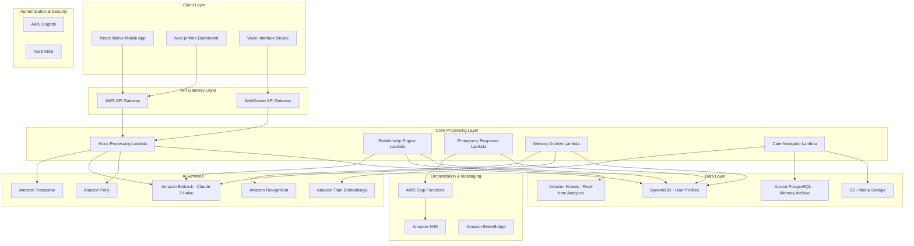

# Design Document: Bandhan AI

## Overview

Bandhan AI is a voice-first, generative AI companion system designed to bridge emotional and physical gaps between aging parents in Tier-2/3 Indian cities and their migrant children. The system leverages AWS Generative AI services to provide emotional mediation, emergency response, memory preservation, and care navigation through a zero-UI voice interface.

The architecture follows a serverless, event-driven design using AWS services to ensure scalability, reliability, and data sovereignty within the ap-south-1 region. The system prioritizes accessibility for elderly users through high-contrast interfaces, large fonts, boosted audio, and haptic feedback.

## Architecture

### High-Level Architecture



### Regional Architecture

All services are deployed in the ap-south-1 (Asia Pacific - Mumbai) region to ensure data sovereignty and comply with Indian data protection requirements. The system uses AWS KMS for encryption key management and implements AES-256 encryption for all data at rest and TLS 1.3 for data in transit.

## Components and Interfaces

### 1. Voice Interface Component

**Purpose**: Provides zero-UI voice interaction with single pulsing circle interface

**Key Technologies**:
- Amazon Transcribe with custom vocabulary for Hinglish, Tanglish, Bengali
- Amazon Polly for natural voice synthesis
- Voice Activity Detection (VAD) for real-time processing
- WebRTC for low-latency audio streaming

**Interfaces**:
```typescript
interface VoiceInterface {
  startListening(): Promise<void>
  stopListening(): Promise<void>
  processVoiceInput(audioStream: AudioStream): Promise<TranscriptionResult>
  synthesizeResponse(text: string, language: LanguageCode): Promise<AudioStream>
  detectVoiceActivity(audioBuffer: ArrayBuffer): boolean
}

interface TranscriptionResult {
  text: string
  confidence: number
  language: LanguageCode
  timestamp: Date
}
```

**Custom Vocabulary Implementation**:
- Maintains domain-specific vocabulary for Indian family terms, medical terminology, and government schemes
- Supports code-mixing patterns common in Indian multilingual conversations
- Regular updates based on usage patterns and accuracy feedback

### 2. Relationship Intelligence Engine

**Purpose**: Tracks bond strength, analyzes mood patterns, and generates insights

**Key Technologies**:
- Amazon Bedrock (Claude 3 Haiku) for mood analysis and relationship insights
- Amazon Kinesis for real-time data streaming and analytics
- Custom acoustic feature extraction for voice-based mood detection

**Interfaces**:
```typescript
interface RelationshipEngine {
  analyzeMood(voiceFeatures: VoiceFeatures): Promise<MoodAnalysis>
  calculateBondScore(interactions: Interaction[]): Promise<BondScore>
  generateWeeklyReport(userId: string): Promise<WeeklyReport>
  detectSignificantChanges(currentMood: MoodAnalysis, historicalData: MoodHistory): Promise<Alert[]>
}

interface MoodAnalysis {
  primaryEmotion: Emotion
  confidence: number
  energyLevel: number
  stressIndicators: string[]
  timestamp: Date
}

interface BondScore {
  score: number // 0-100
  trend: 'improving' | 'stable' | 'declining'
  factors: BondFactor[]
  recommendations: string[]
}
```

**Mood Detection Algorithm**:
- Analyzes acoustic features: pitch variation, speaking rate, pause patterns, voice tremor
- Uses Claude 3 Haiku for contextual understanding of conversation content
- Combines acoustic and semantic analysis for comprehensive mood assessment

### 3. SafeMode Emergency Response System

**Purpose**: Handles emergency detection, triage, and multi-channel alert system

**Key Technologies**:
- AWS Step Functions for orchestrating emergency response workflow
- Amazon SNS for multi-channel notifications (SMS, voice calls, push notifications)
- Amazon Bedrock for emergency severity assessment and de-escalation

**Interfaces**:
```typescript
interface SafeMode {
  detectEmergency(voiceInput: string, context: UserContext): Promise<EmergencyAssessment>
  initiateEmergencyProtocol(assessment: EmergencyAssessment): Promise<ResponseWorkflow>
  escalateAlert(level: AlertLevel, contacts: Contact[]): Promise<AlertResult>
  cancelFalseAlarm(workflowId: string): Promise<boolean>
}

interface EmergencyAssessment {
  severity: 'low' | 'medium' | 'high' | 'critical'
  type: EmergencyType
  confidence: number
  recommendedActions: string[]
  timeToEscalation: number // seconds
}
```

**Emergency Response Workflow**:
1. **Detection Phase**: Keyword detection + contextual analysis using Claude 3 Haiku
2. **Assessment Phase**: Severity scoring and de-escalation attempt
3. **Escalation Phase**: Hyper-local contacts → family → emergency services
4. **Monitoring Phase**: Continuous status updates and callback verification

### 4. Shared Memory Archive (RAG System)

**Purpose**: Stores, indexes, and retrieves family memories with semantic search

**Key Technologies**:
- Amazon Aurora PostgreSQL with pgvector extension for vector storage
- Amazon Titan Embeddings for semantic similarity
- Amazon S3 for media file storage with lifecycle policies
- Amazon Rekognition for photo analysis and tagging

**Interfaces**:
```typescript
interface MemoryArchive {
  storeMemory(content: MemoryContent): Promise<MemoryId>
  searchMemories(query: string, userId: string): Promise<MemoryResult[]>
  generateNarration(imageUrl: string): Promise<string>
  categorizeMemory(content: MemoryContent): Promise<MemoryCategory[]>
}

interface MemoryContent {
  type: 'photo' | 'voice' | 'text'
  content: string | Buffer
  metadata: MemoryMetadata
  participants: string[]
}

interface MemoryResult {
  id: MemoryId
  content: MemoryContent
  similarity: number
  context: string
  relatedMemories: MemoryId[]
}
```

**Vector Search Implementation**:
- Uses Amazon Titan Embeddings to create semantic vectors for all memory content
- Implements hybrid search combining semantic similarity and metadata filtering
- Maintains relationship graphs between memories for contextual retrieval

### 5. Care Navigation System

**Purpose**: Assists with healthcare and bureaucratic tasks through visual and voice AI

**Key Technologies**:
- Amazon Bedrock (Claude 3 Sonnet) with vision capabilities for medicine bottle recognition
- Custom knowledge base for Indian government schemes and healthcare information
- Integration with verified medical databases and government portals

**Interfaces**:
```typescript
interface CareNavigator {
  analyzeMedicineBottle(imageUrl: string): Promise<MedicineInfo>
  explainGovernmentScheme(schemeName: string, userProfile: UserProfile): Promise<SchemeExplanation>
  provideHealthGuidance(symptoms: string[], userHistory: HealthHistory): Promise<HealthAdvice>
  guideFormCompletion(formType: string, userData: UserData): Promise<FormGuidance>
}

interface MedicineInfo {
  name: string
  dosage: string
  instructions: string[]
  warnings: string[]
  interactions: string[]
  confidence: number
}
```

### 6. AI-Enhanced Video Communication

**Purpose**: Provides context-aware conversation assistance for video calls

**Key Technologies**:
- WebRTC for peer-to-peer video communication
- Amazon Bedrock for generating conversation prompts and summaries
- Real-time mood analysis during calls

**Interfaces**:
```typescript
interface VideoAssistant {
  generateConversationStarters(participants: UserProfile[]): Promise<ConversationPrompt[]>
  providePrecallBrief(childUserId: string, parentUserId: string): Promise<CallBrief>
  suggestTopics(callContext: CallContext): Promise<TopicSuggestion[]>
  summarizeCall(callTranscript: string): Promise<CallSummary>
}

interface CallBrief {
  parentMoodTrend: MoodTrend
  recentActivities: Activity[]
  suggestedTopics: string[]
  healthUpdates: HealthUpdate[]
  importantEvents: Event[]
}
```

### 7. Emotion-Aware Messaging System

**Purpose**: Coaches message tone and provides emotional context for communications

**Key Technologies**:
- Amazon Bedrock for tone analysis and suggestion generation
- Amazon Polly with SSML for emotionally appropriate text-to-speech
- Cultural context database for Indian family communication patterns

**Interfaces**:
```typescript
interface MessageCoach {
  analyzeTone(message: string): Promise<ToneAnalysis>
  suggestImprovements(message: string, context: MessageContext): Promise<MessageSuggestion[]>
  synthesizeWithEmotion(text: string, emotion: Emotion, voice: VoiceProfile): Promise<AudioStream>
  simplifyForElderly(complexMessage: string): Promise<string>
}

interface ToneAnalysis {
  primaryTone: Tone
  emotionalIntensity: number
  culturalAppropriateness: number
  suggestions: string[]
}
```

## Data Models

### User Profile Model
```typescript
interface UserProfile {
  userId: string
  role: 'parent' | 'child'
  personalInfo: {
    name: string
    age: number
    preferredLanguages: LanguageCode[]
    location: Location
    healthConditions: string[]
  }
  preferences: {
    voiceSettings: VoiceSettings
    privacyLevel: PrivacyLevel
    emergencyContacts: Contact[]
    notificationPreferences: NotificationSettings
  }
  relationships: {
    familyMembers: FamilyMember[]
    bondScores: BondScore[]
  }
}
```

### Interaction Model
```typescript
interface Interaction {
  interactionId: string
  participants: string[]
  type: 'voice' | 'video' | 'message'
  timestamp: Date
  duration: number
  content: InteractionContent
  moodAnalysis: MoodAnalysis[]
  context: InteractionContext
}
```

### Memory Model
```typescript
interface Memory {
  memoryId: string
  type: MemoryType
  content: MemoryContent
  embedding: number[] // Vector representation
  metadata: {
    createdAt: Date
    participants: string[]
    location?: Location
    tags: string[]
    category: MemoryCategory
  }
  accessibility: {
    isPrivate: boolean
    sharedWith: string[]
    permissions: Permission[]
  }
}
```

### Emergency Event Model
```typescript
interface EmergencyEvent {
  eventId: string
  userId: string
  severity: EmergencySeverity
  type: EmergencyType
  status: 'active' | 'resolved' | 'false_alarm'
  timeline: EmergencyAction[]
  location: Location
  context: EmergencyContext
  resolution: EmergencyResolution
}
```

## Correctness Properties

*A property is a characteristic or behavior that should hold true across all valid executions of a system—essentially, a formal statement about what the system should do. Properties serve as the bridge between human-readable specifications and machine-verifiable correctness guarantees.*

After analyzing all acceptance criteria, I've identified the following testable properties that can be validated through property-based testing:

### Voice Interface Properties

**Property 1: Voice Activity Detection Response Time**
*For any* valid voice input, the Voice_Interface should detect voice activity and begin processing within 200ms
**Validates: Requirements 1.1**

**Property 2: Code-Mixing Language Support**
*For any* supported code-mixing language combination (Hinglish, Tanglish, Bengali), the Voice_Interface should successfully transcribe the input
**Validates: Requirements 1.2**

**Property 3: Listening Interface State**
*For any* listening state, the Voice_Interface should display only a single pulsing circle interface element
**Validates: Requirements 1.3**

**Property 4: Transcription Accuracy**
*For any* voice input in supported languages, the Voice_Interface should achieve at least 95% transcription accuracy
**Validates: Requirements 1.4**

**Property 5: Background Noise Filtering**
*For any* audio input with background noise, the Voice_Interface should successfully filter ambient sounds and focus on the primary speaker
**Validates: Requirements 1.5**

### Relationship Intelligence Properties

**Property 6: Mood Analysis from Voice**
*For any* voice interaction, the Relationship_Engine should analyze acoustic markers and determine a valid mood state
**Validates: Requirements 2.1**

**Property 7: Bond Score Calculation**
*For any* set of call logs, the Relationship_Engine should calculate a Bond_Score based on interaction frequency and duration
**Validates: Requirements 2.2**

**Property 8: Weekly Dashboard Generation**
*For any* completed week period, the Relationship_Engine should generate a Bond_Score dashboard for all Secondary_Users
**Validates: Requirements 2.3**

**Property 9: Mood Change Alerting**
*For any* significant mood pattern change, the Relationship_Engine should alert Secondary_Users within 24 hours
**Validates: Requirements 2.4**

**Property 10: Bond Strength Intervention**
*For any* bond strength decrease below threshold, the Relationship_Engine should suggest appropriate intervention strategies
**Validates: Requirements 2.5**

### Emergency Response Properties

**Property 11: Emergency Detection Speed**
*For any* emergency keyword detection, SafeMode should activate the emergency protocol within 5 seconds
**Validates: Requirements 3.1**

**Property 12: De-escalation Workflow Initiation**
*For any* SafeMode activation, the system should initiate the de-escalation workflow to assess situation severity
**Validates: Requirements 3.2**

**Property 13: Alert Escalation Sequence**
*For any* confirmed emergency, SafeMode should alert contacts in the correct sequence: hyper-local contacts → children → emergency services
**Validates: Requirements 3.3**

**Property 14: Emergency Alert Context**
*For any* emergency alert sent, SafeMode should include real-time location and situation context information
**Validates: Requirements 3.4**

**Property 15: False Alarm Cancellation**
*For any* false alarm occurrence, SafeMode should allow cancellation within 30 seconds
**Validates: Requirements 3.5**

### Memory Archive Properties

**Property 16: Photo Narration Generation**
*For any* uploaded photo, the Memory_Archive should generate a descriptive voice narration of the image content
**Validates: Requirements 4.1**

**Property 17: Story Storage with Metadata**
*For any* shared oral story, the Memory_Archive should store it with searchable metadata
**Validates: Requirements 4.2**

**Property 18: Memory Search Performance**
*For any* memory search request, the Memory_Archive should retrieve relevant content within 3 seconds
**Validates: Requirements 4.3**

**Property 19: Memory Context Information**
*For any* accessed memory, the Memory_Archive should provide contextual information about when and who shared it
**Validates: Requirements 4.4**

**Property 20: Automatic Memory Categorization**
*For any* new memory added, the Memory_Archive should automatically categorize it by relationships and events
**Validates: Requirements 4.5**

### Care Navigation Properties

**Property 21: Medicine Bottle Recognition**
*For any* photographed medicine bottle, the Care_Navigator should identify the medication and provide usage instructions
**Validates: Requirements 5.1**

**Property 22: Government Scheme Explanation**
*For any* government scheme query, the Care_Navigator should explain eligibility and application processes in simple language
**Validates: Requirements 5.2**

**Property 23: Health Information with Disclaimers**
*For any* medical question, the Care_Navigator should provide reliable health information with appropriate disclaimers
**Validates: Requirements 5.3**

**Property 24: Form Completion Guidance**
*For any* complex form encountered, the Care_Navigator should provide step-by-step completion guidance
**Validates: Requirements 5.4**

**Property 25: Health Emergency Escalation**
*For any* health emergency detected in queries, the Care_Navigator should escalate to SafeMode
**Validates: Requirements 5.5**

### Video Communication Properties

**Property 26: Context-Aware Conversation Starters**
*For any* video call initiation, the Video_Assistant should provide relevant context-aware conversation starters
**Validates: Requirements 6.1**

**Property 27: Pre-Call Briefing**
*For any* call about to begin, the Video_Assistant should brief Secondary_Users on recent parent activities and mood
**Validates: Requirements 6.2**

**Property 28: Conversation Topic Suggestions**
*For any* conversation stall, the Video_Assistant should suggest relevant topics based on shared interests
**Validates: Requirements 6.3**

**Property 29: Call Summarization**
*For any* ended call, the Video_Assistant should summarize key discussion points for both parties
**Validates: Requirements 6.4**

**Property 30: Technical Issue Guidance**
*For any* technical issue occurrence, the Video_Assistant should provide simple troubleshooting guidance
**Validates: Requirements 6.5**

### Messaging Properties

**Property 31: Message Tone Analysis**
*For any* composed text message, the Message_Coach should analyze emotional tone and suggest improvements
**Validates: Requirements 7.1**

**Property 32: Emotional Message Reading**
*For any* message received by Primary_Users, the Message_Coach should read it with appropriate emotional intonation
**Validates: Requirements 7.2**

**Property 33: Harsh Language Detection**
*For any* harsh or insensitive language detected, the Message_Coach should suggest gentler alternatives
**Validates: Requirements 7.3**

**Property 34: Cultural Context Guidance**
*For any* culturally important context, the Message_Coach should provide guidance on appropriate expressions
**Validates: Requirements 7.4**

**Property 35: Message Simplification**
*For any* complex message content, the Message_Coach should offer simplified explanations for Primary_Users
**Validates: Requirements 7.5**

### Accessibility Properties

**Property 36: High Contrast Display**
*For any* visual content displayed, the system should use high contrast colors meeting WCAG AAA standards
**Validates: Requirements 8.1**

**Property 37: Minimum Font Size**
*For any* text displayed, the system should use minimum 24px font size for all interface elements
**Validates: Requirements 8.2**

**Property 38: Audio Boost**
*For any* audio feedback provided, the system should boost audio output by 20% above standard levels
**Validates: Requirements 8.3**

**Property 39: Haptic Feedback**
*For any* user interaction, the system should provide haptic feedback for confirmation
**Validates: Requirements 8.4**

**Property 40: Localized Error Messages**
*For any* error occurrence, the system should provide clear, simple error messages in the user's preferred language
**Validates: Requirements 8.5**

### Security Properties

**Property 41: Data Encryption**
*For any* data stored, the system should encrypt all data using AES-256 encryption
**Validates: Requirements 9.1**

**Property 42: Transmission Security**
*For any* data transmitted, the system should use TLS 1.3 for all communications
**Validates: Requirements 9.2**

**Property 43: Regional Data Processing**
*For any* data processed, the system should ensure all processing occurs within ap-south-1 region
**Validates: Requirements 9.3**

**Property 44: Key Management**
*For any* encryption key managed, the system should use AWS KMS for key management
**Validates: Requirements 9.4**

**Property 45: Access Logging**
*For any* user data access, the system should log all access attempts with user identification
**Validates: Requirements 9.5**

### Performance Properties

**Property 46: Voice Command Response Time**
*For any* voice command issued, the system should respond within 500ms for 95% of requests
**Validates: Requirements 10.1**

**Property 47: System Uptime**
*For any* peak usage period, the system should maintain 99.9% uptime
**Validates: Requirements 10.2**

**Property 48: Concurrent User Handling**
*For any* multiple simultaneous users, the system should handle concurrent requests without performance degradation
**Validates: Requirements 10.3**

**Property 49: Automatic Failover**
*For any* system failure, the system should automatically failover to backup systems within 30 seconds
**Validates: Requirements 10.4**

**Property 50: Automated Backup**
*For any* 6-hour period, the system should perform automated backups with point-in-time recovery capability
**Validates: Requirements 10.5**

## Error Handling

### Voice Interface Error Handling
- **Audio Processing Failures**: Graceful degradation to text input with clear user notification
- **Language Detection Errors**: Fallback to primary language with confidence scoring
- **Network Connectivity Issues**: Local caching of critical responses and offline mode for emergency functions
- **Transcription Failures**: Request for repetition with simplified language prompts

### Emergency Response Error Handling
- **False Positive Detection**: 30-second cancellation window with clear cancellation instructions
- **Communication Failures**: Multiple communication channels (SMS, voice, push) with automatic retry logic
- **Service Unavailability**: Local emergency contact activation and manual escalation procedures
- **Location Services Failure**: Manual location input with pre-configured address fallback

### Data and Security Error Handling
- **Encryption Failures**: Immediate service suspension with secure error logging
- **Authentication Errors**: Multi-factor authentication fallback with family member verification
- **Data Corruption**: Automatic backup restoration with integrity verification
- **Regional Compliance Violations**: Immediate data migration with audit trail

### Performance Error Handling
- **Response Time Violations**: Automatic scaling with user notification of delays
- **Memory/Storage Limits**: Intelligent data archival with user consent
- **Concurrent User Limits**: Queue management with estimated wait times
- **Service Dependencies**: Circuit breaker patterns with graceful service degradation

## Testing Strategy

### Dual Testing Approach

The testing strategy employs both unit testing and property-based testing to ensure comprehensive coverage:

**Unit Tests**: Focus on specific examples, edge cases, and integration points
- Emergency keyword detection with specific phrases
- Cultural context validation for Indian family communication
- Medicine bottle recognition with known medications
- Government scheme database accuracy
- Accessibility compliance verification

**Property-Based Tests**: Verify universal properties across all inputs
- Voice processing accuracy across language combinations
- Mood analysis consistency across voice samples
- Memory search performance across various query types
- Security compliance across all data operations
- Performance characteristics under various load conditions

### Property-Based Testing Configuration

**Testing Framework**: Use Hypothesis (Python) or fast-check (TypeScript/JavaScript) for property-based testing
**Test Configuration**: Minimum 100 iterations per property test
**Test Tagging**: Each property test must reference its design document property using the format:
`Feature: bandhan-ai, Property {number}: {property_text}`

**Example Property Test Structure**:
```python
@given(voice_input=voice_samples(), background_noise=audio_noise())
def test_voice_activity_detection_response_time(voice_input, background_noise):
    """Feature: bandhan-ai, Property 1: Voice Activity Detection Response Time"""
    start_time = time.time()
    result = voice_interface.detect_voice_activity(voice_input, background_noise)
    response_time = (time.time() - start_time) * 1000  # Convert to ms
    
    assert response_time < 200, f"Response time {response_time}ms exceeds 200ms limit"
    assert result.detected == True, "Voice activity should be detected"
```

### Integration Testing
- End-to-end emergency response workflows
- Cross-service communication validation
- Multi-language conversation flows
- Family interaction simulation testing
- Regional compliance verification

### Performance Testing
- Load testing with concurrent users (up to 10,000 simultaneous connections)
- Stress testing for emergency response scenarios
- Memory and storage optimization validation
- Network latency impact assessment
- Mobile device performance across various hardware configurations

### Security Testing
- Penetration testing for voice interface vulnerabilities
- Data encryption validation across all storage and transmission points
- Authentication and authorization testing
- Regional data sovereignty compliance verification
- Privacy protection validation for sensitive family data

### Accessibility Testing
- Screen reader compatibility testing
- High contrast display validation
- Large font rendering verification
- Haptic feedback functionality testing
- Multi-language accessibility compliance